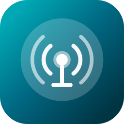
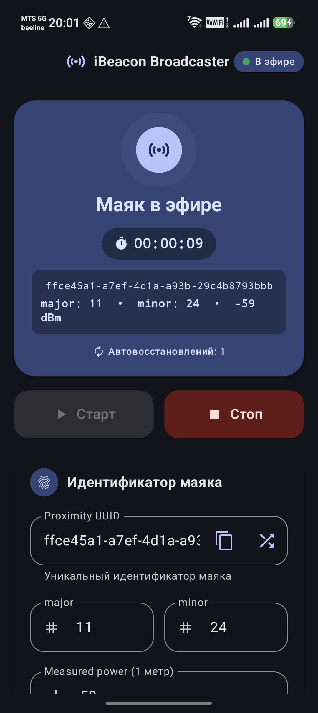
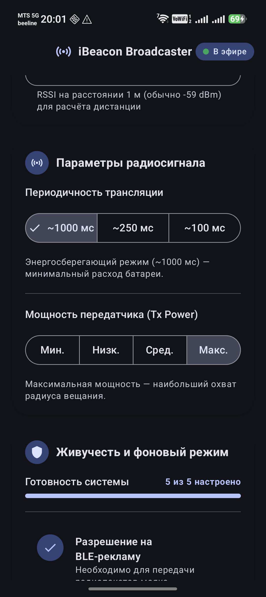

# iBeacon Broadcaster for Android

<p align="center">
  
</p>

<p align="center">
  <strong>A resilient standalone iBeacon transmitter featuring modern Material 3 UI and multi-tier system background keep-alive defense.</strong>
</p>

<p align="center">
  <a href="https://developer.android.com/about/versions/15"></a>
  <a href="https://kotlinlang.org/"></a>
  <a href="https://developer.android.com/jetpack/compose"></a>
  <a href="https://github.com/balookrd/ibeacon/actions/workflows/ci.yml"></a>
  <a href="LICENSE"></a>
</p>

<p align="center">
  <a href="README.md">Русский</a> | <strong>English</strong>
</p>

---

## 📱 About the Project

**iBeacon Broadcaster** turns your Android smartphone into a full-featured Apple iBeacon Bluetooth LE transmitter with configurable **UUID**, **Major**, **Minor**, and calibration power (**Measured Power**).

The core goal of the project is **reliable, continuous advertisement**. Most existing beacon apps stop transmitting once the screen turns off, when the system enters Doze mode, or when the user clears the app from the recent tasks list. iBeacon Broadcaster is designed for maximum endurance in aggressive background execution environments across modern Android versions and vendor skins (MagicOS, EMUI, MIUI/HyperOS, OneUI).

---

## ✨ Screenshots

<p align="center">
  
  &nbsp;&nbsp;&nbsp;&nbsp;
  
</p>

---

## 🚀 Key Features

- **Standard iBeacon Protocol**: Assembles compliant 30-byte BLE Advertising packets (Apple Company ID `0x004C`, type `0x02`, length `0x15`).
- **Modern Material 3 Interface**:
  - Full support for **Material You Dynamic Color** (Android 12+) — color scheme adapts to system wallpaper and palette.
  - Complete Dark and Light theme implementations.
  - **Status Hero Card**: Animated radar, real-time uptime timer, live parameter summary, and revival counter.
  - Single-choice segmented button rows for advertisement rate and transmitter power.
  - Random UUID generator and one-tap clipboard copy button.
  - Real-time form validation with clear field highlighting for out-of-range values.
- **Interactive Keep-Alive Checklist**:
  - Readiness progress bar (e.g. `5 of 5 configured`).
  - Direct one-tap navigation to system settings for battery optimization exemption, autostart management, and runtime permissions.
- **Notification Shade Integration**:
  - Persistent Foreground Service notification showing live broadcast parameters.
  - One-tap "Stop" action directly from the notification shade.
  - Clean, dedicated monochrome beacon icon in the Android status bar.

---

## 🛡️ Keep-Alive Architecture

To maintain continuous broadcasting, the app utilizes a defense-in-depth approach:

1. **Foreground Service (`connectedDevice`)**: Declared with the specific connected-device foreground service type for Android 14+ and marked `START_STICKY`.
2. **Swipe Dismissal Recovery (`onTaskRemoved`)**: When swiped out from Recents, the app schedules an immediate exact revival alarm via `AlarmManager`.
3. **Partial WakeLock**: Prevents the CPU from entering deep sleep while transmitting to protect the BLE stack.
4. **Dual Watchdogs**:
   - **Exact Alarm Watchdog (`WatchdogAlarm`)**: Fires every ~5 minutes using `setExactAndAllowWhileIdle` to punch through Android Doze mode.
   - **Background Worker Watchdog (`WatchdogWorker`)**: Periodic `WorkManager` (15-minute interval) ensures resilience across device reboots and long idle states.
5. **Internal Self-Check Loop**: A coroutine inside the service verifies every 30 seconds that the BLE stack hasn't silently dropped the advertisement, restarting it if necessary.
6. **Bluetooth State Monitoring**: A `BroadcastReceiver` automatically re-raises the beacon when Bluetooth is toggled off and back on.
7. **System Boot Autostart**: Handles `BOOT_COMPLETED`, `LOCKED_BOOT_COMPLETED`, and `MY_PACKAGE_REPLACED`.
8. **Device-Protected Storage**: Configuration is stored in device-encrypted storage, allowing the beacon to resume broadcasting immediately after boot **before the user unlocks the screen**.

---

## 📡 iBeacon Packet Structure (Wire Format)

The BLE Non-connectable Undirected Advertising packet is structured according to Apple specifications:

| Byte | Field | Value | Description |
| :--- | :--- | :--- | :--- |
| `0..1` | Flags AD Type | `0x02, 0x01` | Length 2, Flags AD type |
| `2` | Flags Value | `0x06` | LE General Discoverable + BR/EDR Not Supported |
| `3..4` | Manufacturer Data Header | `0x1A, 0xFF` | Length 26 bytes (0x1A), Manufacturer Specific type (0xFF) |
| `5..6` | Company Identifier | `0x4C, 0x00` | Apple Inc. (Little-Endian: `0x004C`) |
| `7` | Beacon Type | `0x02` | iBeacon specification identifier |
| `8` | Data Length | `0x15` | Payload length (21 bytes) |
| `9..24` | Proximity UUID | 16 bytes | 128-bit identifier (Big-Endian) |
| `25..26` | Major | 2 bytes | Group identifier `0..65535` (Big-Endian) |
| `27..28` | Minor | 2 bytes | Beacon identifier `0..65535` (Big-Endian) |
| `29` | Measured Power | 1 byte | Calibrated RSSI at 1 meter (int8, typically `-59 dBm`) |

---

## ⚙️ Radio Settings

### Transmission Rate (Advertise Mode)
Mapped directly to Android BLE advertiser presets:
- **`~1000 ms`** (`ADVERTISE_MODE_LOW_POWER`): Maximum energy savings, ideal for stationary beacons.
- **`~250 ms`** (`ADVERTISE_MODE_BALANCED`): Balanced rate, recommended for general use.
- **`~100 ms`** (`ADVERTISE_MODE_LOW_LATENCY`): High-frequency advertisement for fast mobile detection.

### Transmitter Power (Tx Power)
Controls signal coverage and physical range:
- **Min** (`TX_POWER_ULTRA_LOW`): Smallest radius, lowest energy draw.
- **Low** (`TX_POWER_LOW`): Suitable for single-room tracking.
- **Med** (`TX_POWER_MEDIUM`): Balanced indoor/outdoor coverage.
- **Max** (`TX_POWER_HIGH`): Maximum range and signal penetration.

---

## 🛠️ Build and Installation

### Prerequisites
- **Android Studio** Ladybug (2024.2+) or newer.
- **JDK 17+** (bundled JBR in Android Studio).
- **Android SDK Platform 35**.

### Build Debug APK
```bash
JAVA_HOME="/Applications/Android Studio.app/Contents/jbr/Contents/Home" ./gradlew assembleDebug
```
Output: `app/build/outputs/apk/debug/app-debug.apk`

### Run Unit Tests
```bash
JAVA_HOME="/Applications/Android Studio.app/Contents/jbr/Contents/Home" ./gradlew test
```

### Build Signed Release APK
Create `keystore.properties` in the project root (ignored by `.gitignore`):
```properties
storeFile=keystore/release.jks
storePassword=YOUR_STORE_PASSWORD
keyAlias=YOUR_KEY_ALIAS
keyPassword=YOUR_KEY_PASSWORD
```

Build with R8 optimization and resource shrinking:
```bash
JAVA_HOME="/Applications/Android Studio.app/Contents/jbr/Contents/Home" ./gradlew assembleRelease
```
Output: `app/build/outputs/apk/release/app-release.apk` (~1.2 MB).

### Install via ADB
```bash
~/Library/Android/sdk/platform-tools/adb install -r app/build/outputs/apk/release/app-release.apk
```

---

## 📋 Vendor Firmware Guidelines (OEM)

Aggressive background managers on OEM devices may require one-time manual setup (supported by the in-app checklist):

- **Honor (MagicOS) / Huawei (EMUI)**:
  1. Navigate to *Settings -> Battery -> App launch*.
  2. Locate *iBeacon*, switch off "Manage automatically", and enable: "Auto-launch", "Secondary launch", and "Run in background".
  3. Lock the app in the *Recents* view (pull card down until the lock icon appears).
- **Xiaomi / POCO (MIUI / HyperOS)**:
  1. Enable *Autostart* in App Info.
  2. Set *Battery saver* to "No restrictions".
- **Samsung (OneUI)**:
  1. Go to *App Info -> Battery* and select "Unrestricted".

> [!NOTE]
> Triggering "Force Stop" from Android system settings blocks all alarms and background jobs until manually launched again. This is an Android security constraint common to all apps.

---

## 🔄 Continuous Integration & Releases (CI/CD)

The repository features automated **GitHub Actions** workflows:

- **CI (`.github/workflows/ci.yml`)**:
  - Triggers on every Pull Request and push to `main`.
  - Runs unit tests (`./gradlew test`), linter checks (`./gradlew lintDebug`), and builds the debug APK (`./gradlew assembleDebug`).
- **Release (`.github/workflows/release.yml`)**:
  - Automatically triggers when a tag matching `v*` (e.g. `v1.0.0`) is pushed, or manually through **Actions -> Release -> Run workflow**.
  - Automatically calculates incremental `versionCode` from build epoch time.
  - Assembles the release APK with R8 code and resource shrinking.
  - Computes SHA-256 checksums (`SHA256SUMS.txt`).
  - Creates a GitHub Release, attaches the release APK and checksum file, and generates release notes.

### Repository Signing Secrets
To produce signed APKs in GitHub Actions, configure the following secrets (*Settings -> Secrets and variables -> Actions*):
- `KEYSTORE_BASE64`: The `release.jks` file encoded as Base64 (`base64 -i keystore/release.jks | pbcopy` on macOS).
- `KEYSTORE_PASSWORD`: Keystore password.
- `KEY_ALIAS`: Key alias.
- `KEY_PASSWORD`: Key password.

*If secrets are omitted, the workflow will produce an unsigned release APK.*

---

## 📄 License

This project is licensed under the **Apache License 2.0**. See the [LICENSE](LICENSE) file for details.
